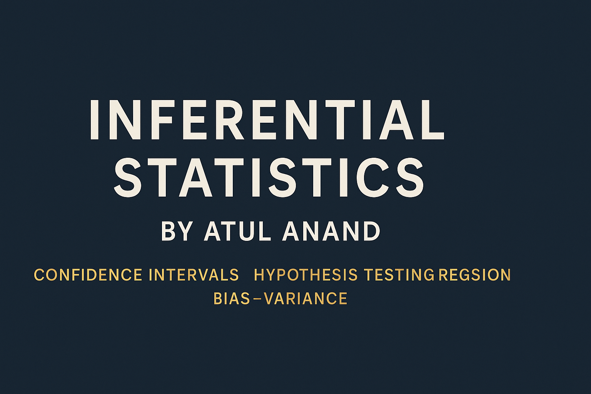

# 📊 Inferential Statistics – Practical Notebooks & Visualizations

> *A hands-on repository focused on inferential statistics: confidence intervals, hypothesis testing, regression, and bias–variance trade-off – explained through Python notebooks and visualizations.*




---

## 📂 Repository Overview

| Folder / File          | What it contains                                                                                                                                                             |
| :--------------------- | :--------------------------------------------------------------------------------------------------------------------------------------------------------------------------- |
| **Notebooks (.ipynb)** | Practical, concept-driven notebooks on inferential statistics topics: confidence intervals, t-tests, chi-square tests, ANOVA, A/B testing, regression, and gradient descent. |
| **Images/**            | Visuals, distribution plots, bias–variance diagrams, GIFs of gradient descent, and more to build intuition.                                                                  |
| **Practice/**          | Case study notebook (*hypothesis\_testing\_case\_study.ipynb*) applying statistical tests to real-like data.                                                                 |
| **Datasets**           | Example CSV files (*placement.csv*, *sample\_distribution\_data.csv*) used in notebooks.                                                                                     |
| **Checkpoints**        | Auto-saved Jupyter checkpoints (can be ignored).                                                                                                                             |

---

## 🧠 Topics Focused On

> Focused on *inferential* rather than purely descriptive statistics:

* Confidence Intervals: Z-procedure & T-procedure
* Hypothesis Testing: one-sample t-test, chi-square test, ANOVA, A/B testing
* Regression Analysis: simple linear, multiple linear, polynomial, and Ridge regularization
* Gradient Descent: concept + visualization
* Bias–Variance Trade-off
* Evaluation Metrics: MSE, R², etc.

Plus GIFs & images to *see* the math in action.

---

## ⚙️ Prerequisites

Before diving in, you should know:

* Basic descriptive stats (mean, variance, std deviation)
* Python basics: `numpy`, `pandas`, `matplotlib`, `seaborn`
* Probability basics & common distributions

> **My take, ATUL:**
> Your choice to skip absolute basics keeps this repo sharp & useful for those who already know fundamentals.

---

## 🚀 Why use this repo?

✅ Code-first, visual approach
✅ See abstract concepts (like bias–variance) come alive
✅ Helpful for interview prep or learning projects
✅ Ready-to-run, beginner-friendly notebooks

---

## 📌 How to get started

```bash
git clone https://github.com/<your-username>/Statistics.git
cd Statistics
```

* Install Python dependencies: `pip install numpy pandas scipy matplotlib seaborn`
* Open notebooks in **Jupyter**, **VS Code**, or **Google Colab**
* Tweak, test, and explore

---

## ✏️ Author

👤 **Atul Anand** – exploring data science & analytics through practical notebooks and visuals.
Connect on [LinkedIn]([https://www.linkedin.com/](https://www.linkedin.com/in/data-analyst-atulanand/)) or see more work on [GitHub]([https://github.com/](https://github.com/Atul570)).

---

## ⭐ Support & Share

* 🌟 Star this repo if it helps you
* Share with fellow learners
* Open issues or suggest improvements

---

## 📢 License

This repository is shared for learning & educational purposes.

---

### 🔍 *Inferential statistics isn’t just theory — it’s insight in action!*
